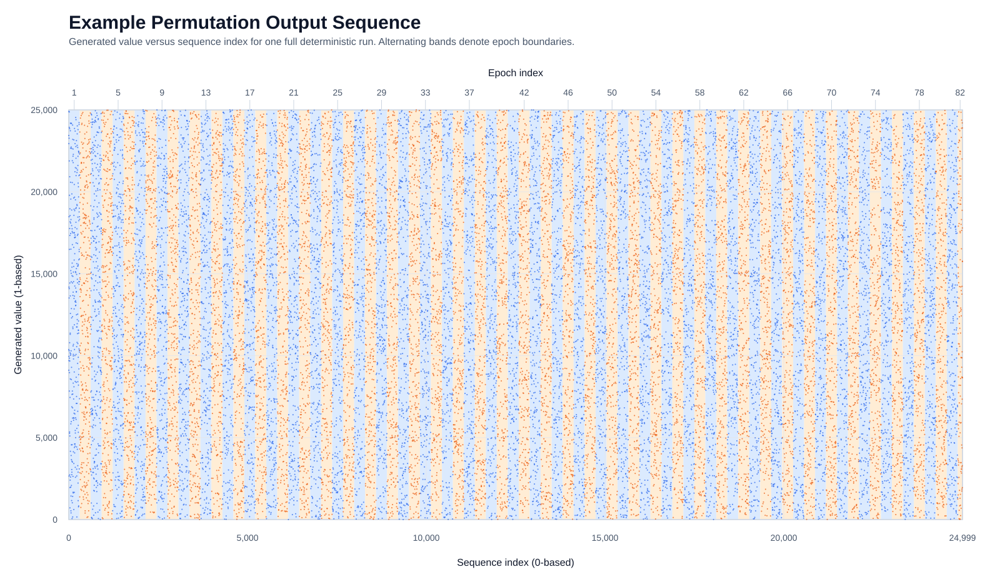
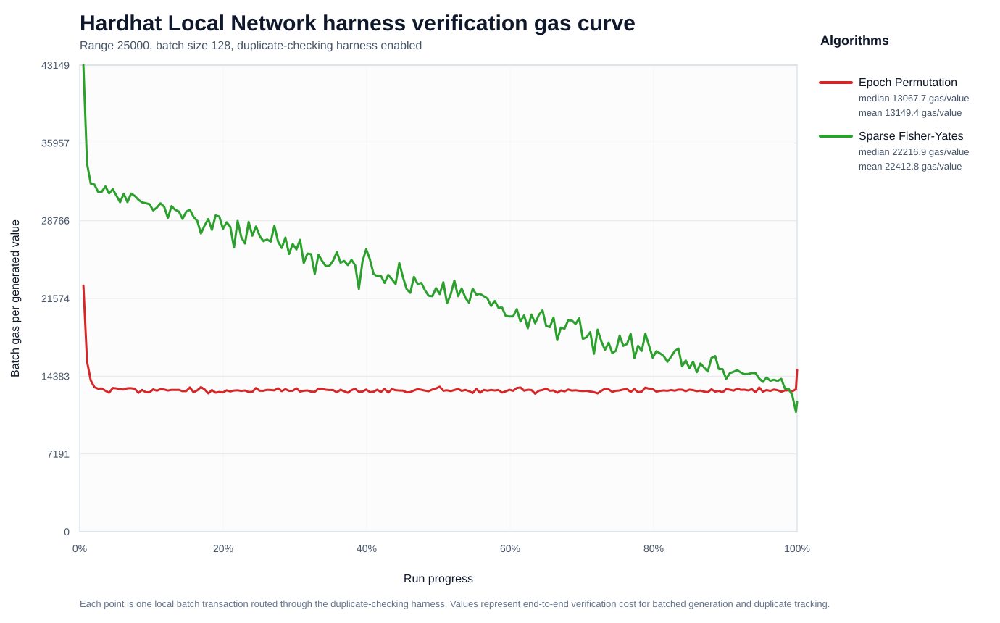
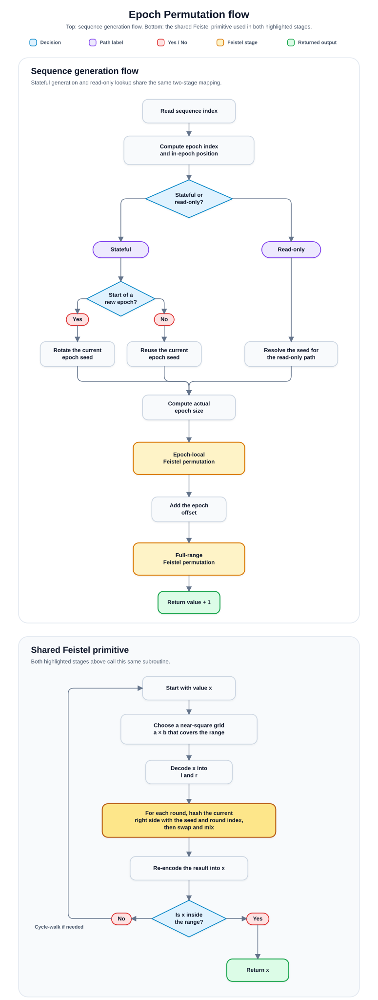

# Epoch Permutation: Epoch-Based Feistel Permutation for Deterministic Sequence Generation


**EpochPermutation** generates bounded, non-repeating sequences without storing a shuffled array. Each sequence position maps to a unique value, making it useful when storing the full order would be expensive or impractical.

The sequence is divided into epochs. Fixed seeds reproduce the complete sequence, while runtime-generated epoch seeds can depend on time, system state, external events, or new entropy. This allows later mappings to remain unknown until their inputs exist, while preserving reproducibility afterward.

Applications include non-repeating event rotation and procedural generation in games and simulations, as well as dispersed traversal of large datasets. In smart contracts, compact state reduces storage costs, while delayed epoch seeds can limit advance knowledge of outputs and reduce opportunities for transaction reordering, front-running, and other MEV strategies.

The result is bounded, non-repeating, compact, and reproducible from its seeds and configuration. In the repository’s EVM benchmarks, it is also less gas-intensive than the benchmarked sparse Fisher–Yates variant.

*The repository includes JavaScript and Solidity implementations, a shared Rust core with Solana and CosmWasm adapters, and native ports for Aptos Move, Starknet Cairo, and Sui Move.*

<p>
  
  
  
  
  
  
  
  
  
  
</p>

## Example

A sequence containing `1–12` might use an epoch-size range of `4–6`. If the generated epoch size is `6`, the sequence has two epochs.

```text
Range:             1–12
Epoch-size range:  4–6
Generated size:    6
Global seed:       0x9f2c84d01a762cb330d5a5f08c66366745cd3eb763954ba2d221e22891577a41

Epoch:             1
Seed:              0x3bd8365c9b162c70d5084c746fe9505ec287c843326d47963e5f530931a2c912
Generated values:  9, 2, 11, 5, 1, 8

Epoch:             2
Seed:              derived from previous epoch's seed
Generated values:  unknown
```



<details>
<summary>Reference run metadata and epoch seeds</summary>


</details>

<details>
<summary>Local harness verification gas curve</summary>



</details>

_This repository does not include a public testnet deployment. Public faucet access to testnet ETH was not reliable enough for a repeatable deployment workflow, so EVM validation was performed on the local Hardhat network._

## Table of Contents

- [Requirements](#requirements)
- [Setup](#setup)
- [Quick start](#quick-start)
- [How It Works](#how-it-works)
- [Implementation Guides](#implementation-guides)
- [Commands](#commands)
- [License](#license)

## Requirements

- Node.js and npm
- `npm install`
- Additional toolchains are only needed if you are working on a specific runtime guide below

## Setup

```powershell
npm install
```

That is enough for the root JavaScript and local EVM workflows. If you want Rust, Aptos, Starknet, or Sui commands, use the implementation guide for that target.

## Quick start

Run the full EVM test flow.

```powershell
npm run evm:test
```

This is the default EVM entrypoint. It runs `evm:typecheck`, `evm:test:unit`, and `evm:test:local` together.

Run the JavaScript reference tests.

```powershell
npm run js:test
```

## How It Works

Each instance fixes an `EPOCH_SIZE` and a `GLOBAL_SEED`, then applies an epoch-local Feistel permutation followed by a full-range Feistel permutation. In deterministic JS mode, `view()` can reconstruct any index from the configured seed; in JS runtime mode and in the EVM contract, read-only lookup is only exact for the current epoch.

<p align="center">
  
</p>

## Implementation Guides

| Target                   | Guide                                                                      |
| ------------------------ | -------------------------------------------------------------------------- |
| Repo-wide matrix         | [`implementations/README.md`](implementations/README.md)                   |
| EVM / Solidity           | [`implementations/evm/README.md`](implementations/evm/README.md)           |
| JavaScript               | [`implementations/js/README.md`](implementations/js/README.md)             |
| Rust / Solana / CosmWasm | [`implementations/rust/README.md`](implementations/rust/README.md)         |
| Aptos Move               | [`implementations/aptos/README.md`](implementations/aptos/README.md)       |
| Starknet / Cairo         | [`implementations/starknet/README.md`](implementations/starknet/README.md) |
| Sui Move                 | [`implementations/sui/README.md`](implementations/sui/README.md)           |

## Commands

### Repo-wide

| Goal                                         | Command               |
| -------------------------------------------- | --------------------- |
| Remove generated outputs and caches          | `npm run repo:clean`  |
| Run the full cross-runtime verification pass | `npm run repo:verify` |

### EVM

| Goal                                                                                    | Command                     |
| --------------------------------------------------------------------------------------- | --------------------------- |
| Compile contracts                                                                       | `npm run evm:compile`       |
| Typecheck Hardhat + TypeScript integration                                              | `npm run evm:typecheck`     |
| Run the full EVM test flow: typecheck, unit tests, and local harness verification       | `npm run evm:test`          |
| Run the contract assertions in `implementations/evm/test`                               | `npm run evm:test:unit`     |
| Run the end-to-end harness flow and write artifacts under `results/local-verification/` | `npm run evm:test:local`    |
| Run the EVM gas benchmark preset                                                        | `npm run evm:benchmark:gas` |

### JavaScript

| Goal                                           | Command             |
| ---------------------------------------------- | ------------------- |
| Run the JS stress runner with default settings | `npm run js:stress` |
| Run the JS test preset                         | `npm run js:test`   |

### Rust / Solana / CosmWasm

| Goal                       | Command                       |
| -------------------------- | ----------------------------- |
| Test the Rust workspace    | `npm run rust:test`           |
| Check the Rust workspace   | `npm run rust:check`          |
| Build the Solana adapter   | `npm run rust:build:solana`   |
| Build the CosmWasm adapter | `npm run rust:build:cosmwasm` |

### Aptos

| Goal                      | Command                 |
| ------------------------- | ----------------------- |
| Compile the Aptos package | `npm run aptos:compile` |
| Test the Aptos package    | `npm run aptos:test`    |

### Starknet

| Goal                       | Command                  |
| -------------------------- | ------------------------ |
| Build the Starknet package | `npm run starknet:build` |
| Test the Starknet package  | `npm run starknet:test`  |

### Sui

| Goal                  | Command             |
| --------------------- | ------------------- |
| Build the Sui package | `npm run sui:build` |
| Test the Sui package  | `npm run sui:test`  |

## License

MIT. See [`LICENSE`](LICENSE).
